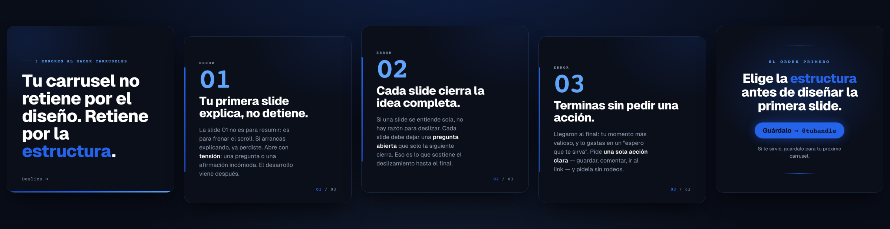
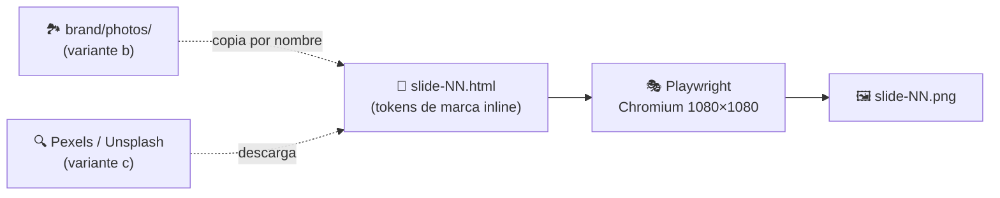
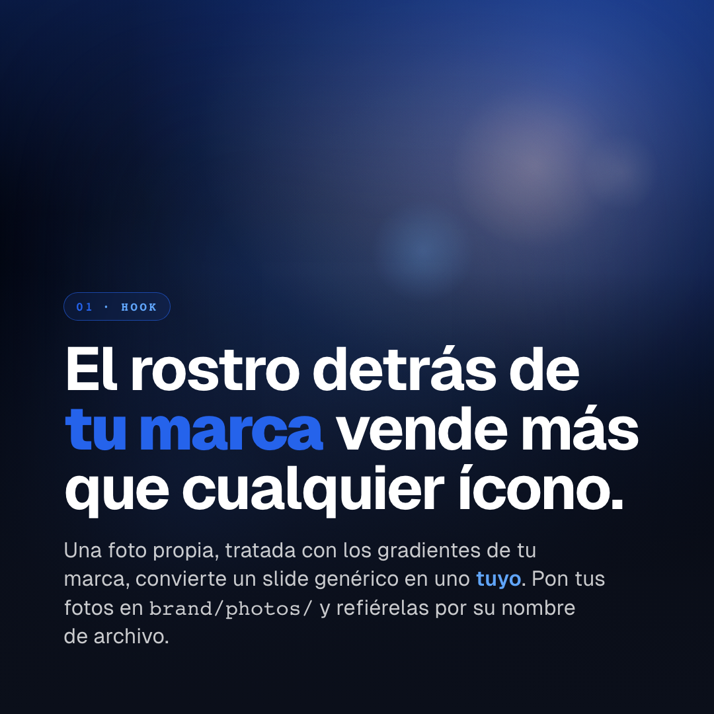
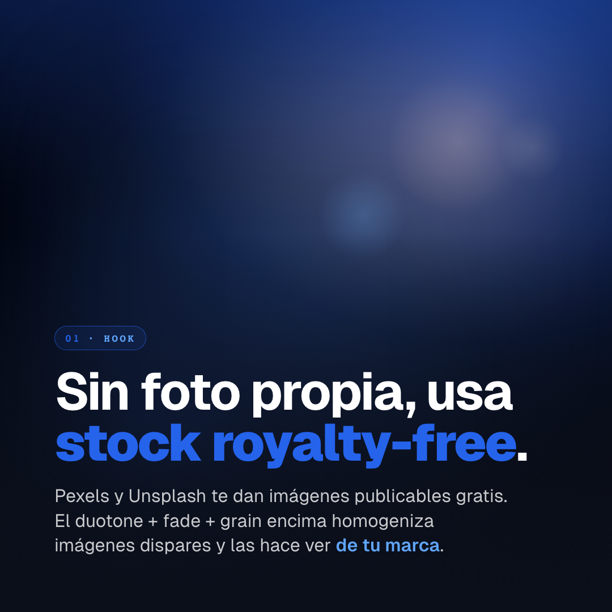
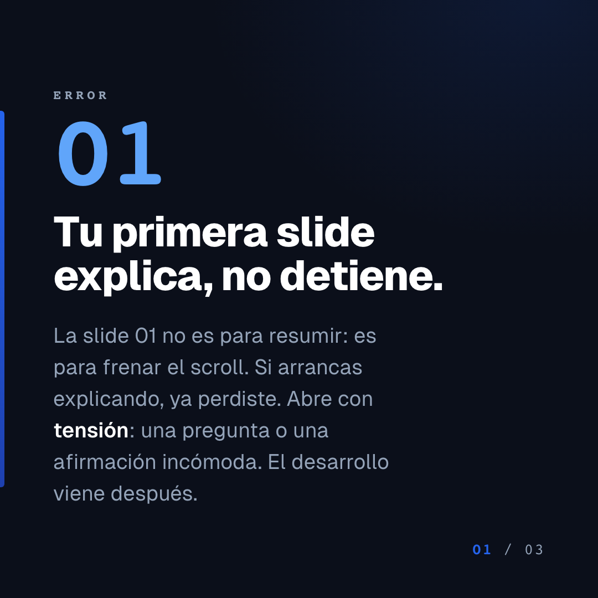
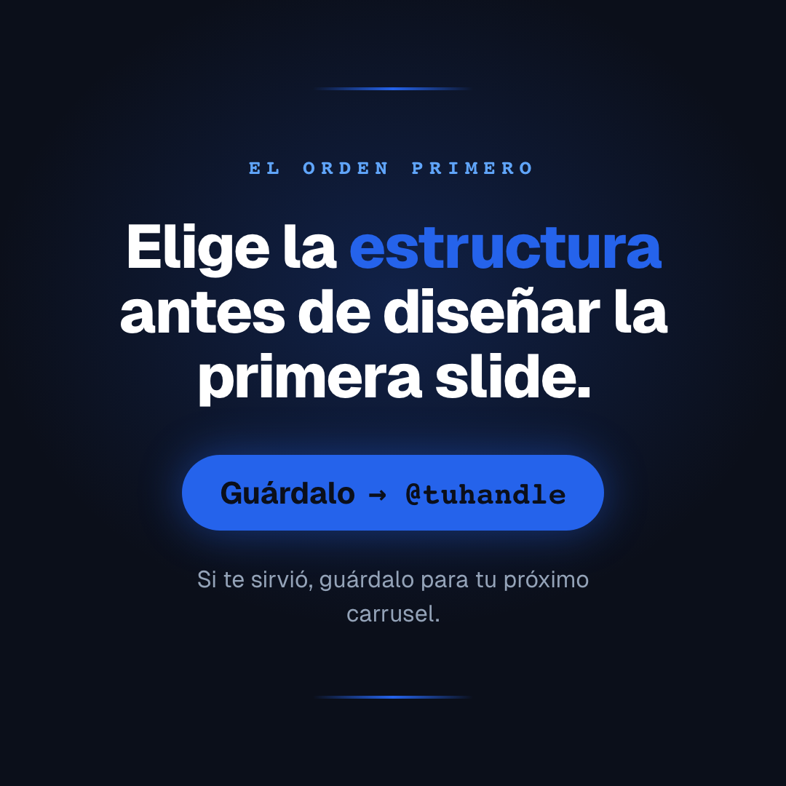

<div align="center">

# 🎠 forge-studio-lite

### Generador de carruseles de Instagram — del texto al PNG, sin diseñar a mano

Slides **1080×1080** consistentes con tu marca, escritos en HTML + CSS y capturados por
Playwright. **100 % local · determinístico · $0.** Sin generación de imágenes con IA en la
variante por defecto.

<br>



<br>

[](LICENSE)


</div>

---

Es la versión **mínima y regalable** del estudio: solo el generador de carruseles con sus
**3 variantes**. Sin los demás pipelines, sub-agentes ni servidores. Clónalo, instala el
stack y empieza a producir carruseles para tu marca en minutos.

> El valor de un carrusel está en **la historia** (la estructura narrativa) y en **tu marca**
> (tus tokens), no en efectos. Aquí el agente escribe los slides; el TypeScript solo
> screenshea. Determinístico: el mismo HTML produce el mismo PNG siempre.

## Tabla de contenidos

- [Cómo funciona](#cómo-funciona)
- [Requisitos](#requisitos)
- [Instalación](#instalación)
- [Quickstart](#quickstart)
- [Las 3 variantes](#las-3-variantes)
- [Galería del ejemplo](#galería-del-ejemplo)
- [Dos formas de usarlo](#dos-formas-de-usarlo)
- [Personaliza tu marca](#personaliza-tu-marca)
- [Variante (c): keys + licencia](#variante-c-keys--licencia)
- [Costo y velocidad](#costo-y-velocidad)
- [Estructura del repo](#estructura-del-repo)
- [Créditos](#créditos)
- [Licencia](#licencia)

## Cómo funciona

Un solo motor, tres pasos. Tú (o el agente) escribes un HTML por slide; Playwright lo captura.



```
slides/source/slide-NN.html  →  Playwright (Chromium, viewport 1080×1080)  →  slides/slide-NN.png
```

Ese es todo el motor (`src/pipelines/carousel.ts`, ~120 líneas). Cada slide es **auto-contenido**:
los tokens de `brand/brand.css` se copian *inline* en su `<style>`, así renderiza desde cualquier
ruta sin links externos.

## Requisitos

| | |
|---|---|
| **Node.js 18+** | usa `fetch` global y `--env-file` |
| **Claude Code** *(opcional, recomendado)* | maneja el flujo `/carrusel` por ti |
| **~250 MB** | para el Chromium de Playwright |
| **Pexels/Unsplash key** *(opcional, solo variante c)* | gratis — imágenes royalty-free |

## Instalación

```bash
git clone https://github.com/Carlos-Dominguez-faber/forge-studio-lite
cd forge-studio-lite
./setup.sh
```

`setup.sh` es idempotente: verifica Node, corre `npm install`, instala Chromium y crea `.env`.
Equivalente manual:

```bash
npm install && npx playwright install chromium && cp .env.example .env
```

## Quickstart

```bash
npm run carrusel -- examples/carousel-typographic
# → examples/carousel-typographic/slides/slide-01.png … (1080×1080, ~6s)
```

`npm run carousel -- ...` es el alias en inglés. ¿Sin `.env`? También corre directo:
`npx tsx src/pipelines/carousel.ts examples/carousel-typographic`.

## Las 3 variantes

Puedes **mezclarlas** en un mismo carrusel (p. ej. hook typographic → puntos typographic → CTA con foto).

<table>
<tr>
<td width="33%" align="center"></td>
<td width="33%" align="center"></td>
<td width="33%" align="center"></td>
</tr>
<tr>
<td align="center"><b>(a) Typographic</b><br>Texto puro · $0 · sin imágenes</td>
<td align="center"><b>(b) Foto + gradiente</b><br>Tu foto del banco + wash de marca</td>
<td align="center"><b>(c) Stock royalty-free</b><br>Pexels / Unsplash publicables</td>
</tr>
</table>

| Variante | Qué es | Necesita | Ejemplo |
|---|---|---|---|
| **(a) Typographic** | Fondo dark + tipografía grande + keyword highlight. El caso por defecto y el más usado. | nada | [`examples/carousel-typographic`](examples/carousel-typographic) |
| **(b) Foto + gradiente** | Foto del banco `brand/photos/` con gradientes de marca al frente (duotone + fade + grain). Referencia por **bare filename** (``); `carousel.ts` la copia sola. | tus fotos en `brand/photos/` | [`examples/carousel-photo`](examples/carousel-photo) |
| **(c) Stock royalty-free** | Imágenes ilustrativas de Pexels/Unsplash, publicables. Escribe `stock-queries.json`, corre `npm run scrape-images`. | `PEXELS_API_KEY` o `UNSPLASH_ACCESS_KEY` | [`examples/carousel-stock`](examples/carousel-stock) |

## Galería del ejemplo

El ejemplo `carousel-typographic` es un carrusel *sobre cómo hacer carruseles* — hook → 3 errores → CTA.

<details>
<summary><b>Ver las 5 slides</b></summary>

<br>

<table>
<tr>
<td width="20%"></td>
<td width="20%"></td>
<td width="20%"></td>
<td width="20%"></td>
<td width="20%"></td>
</tr>
<tr>
<td align="center"><sub>hook</sub></td>
<td align="center"><sub>punto · 01</sub></td>
<td align="center"><sub>punto · 02</sub></td>
<td align="center"><sub>punto · 03</sub></td>
<td align="center"><sub>cta</sub></td>
</tr>
</table>

</details>

## Dos formas de usarlo

### 1. Con Claude Code (recomendado)

```
/carrusel 3 errores al elegir tu nicho, educativo, 5 slides
```

El agente lee `brand/`, elige una estructura de [`docs/estructuras-narrativas.md`](docs/estructuras-narrativas.md)
(35 estructuras narrativas catalogadas), sigue el gate de [`docs/flujo-guiado.md`](docs/flujo-guiado.md)
(te muestra el outline y pide OK antes de renderizar), escribe `STORYBOARD.md` + los slides HTML,
y corre `npm run carrusel`.

### 2. Manual

Escribe tú los `slides/source/slide-NN.html` (parte del skeleton del ejemplo) y corre:

```bash
npm run carrusel -- ./carousels/<slug>
```

Los carruseles que generes viven en `./carousels/<slug>/` (gitignored).

## Personaliza tu marca

Edita estos tres archivos — son la única fuente de verdad de marca. Vienen con un **starter
neutral** ("YOUR BRAND", paleta azul): reemplázalo por el tuyo.

| Archivo | Qué define |
|---|---|
| [`brand/brand.json`](brand/brand.json) | paleta de colores + fuentes + tagline + palabras safe/avoid |
| [`brand/voice.json`](brand/voice.json) | tono, hooks, audiencia, palabras a evitar |
| [`brand/brand.css`](brand/brand.css) | los tokens (`--primary`, `--bg`, `--font-display`…) que cada slide copia inline |

Opcional: pon tu logo en `brand/assets/logo.png` y tus fotos en `brand/photos/`.

> **¿Por qué inline?** Cada slide debe ser auto-contenido para renderizar desde cualquier ruta.
> El agente copia los tokens de `brand.css` al `<style>` de cada HTML; no se enlaza `brand.css` externamente.

## Variante (c): keys + licencia

Saca una key gratis y ponla en `.env`:

```bash
PEXELS_API_KEY=...        # https://www.pexels.com/api/
UNSPLASH_ACCESS_KEY=...   # https://unsplash.com/developers
```

`npm run scrape-images -- <dir>` lee `stock-queries.json`, descarga a `slides/source/<prefix>-NN.jpg`
y escribe un `*-manifest.json` con el fotógrafo + la URL + la licencia de cada imagen (para
atribución, apreciada pero no obligatoria). Pexels y Unsplash son **royalty-free, publicables**
para uso comercial.

## Costo y velocidad

| Variante | Costo | Velocidad |
|---|---|---|
| (a) Typographic | **$0** | ~5–15s / 5 slides |
| (b) Foto + gradiente | **$0** | ~5–15s / 5 slides |
| (c) Stock royalty-free | **$0** (tier gratis Pexels/Unsplash) | + descarga |

Nunca hay costo por generación de imágenes. Todo local.

## Estructura del repo

```
src/pipelines/carousel.ts          # el motor (Playwright screenshot + copia de fotos del banco)
scripts/scrape-carousel-images.ts  # variante (c): descarga stock royalty-free
src/lib/{stock,download,paths}.ts  # helpers
brand/                             # tu marca (starter neutral — edítalo)
templates/carousel/photo-slide.html# plantilla de slide foto+gradiente
docs/estructuras-narrativas.md     # 35 estructuras narrativas
docs/flujo-guiado.md               # el gate de aprobación
examples/                          # un ejemplo corrible por variante
.claude/commands/carrusel.md       # el "cerebro" del agente (/carrusel y alias /carousel)
```

## Créditos

- **Fuente** [Geist](https://vercel.com/font) (Vercel) — gratis, license-clean.
- **Imágenes** [Pexels](https://www.pexels.com/) · [Unsplash](https://unsplash.com/) (variante c).
- **Estructuras narrativas** adaptadas de [santmun/historias-ig-skill](https://github.com/santmun/historias-ig-skill).
- Construido para manejarse desde [Claude Code](https://claude.com/claude-code).

## Licencia

[MIT](LICENSE) — úsalo, modifícalo y compártelo libremente.

<div align="center"><sub>Hecho con 🔨 · una pieza de <b>Forge Studio</b>, en abierto.</sub></div>
